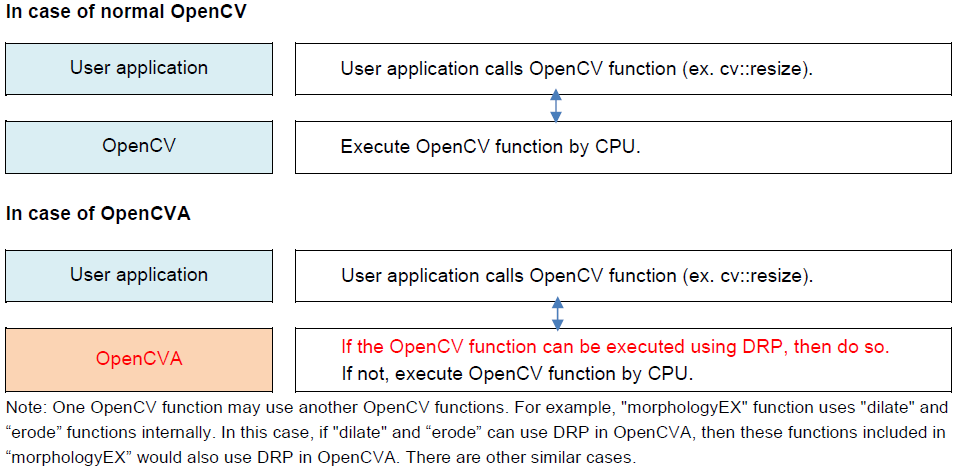
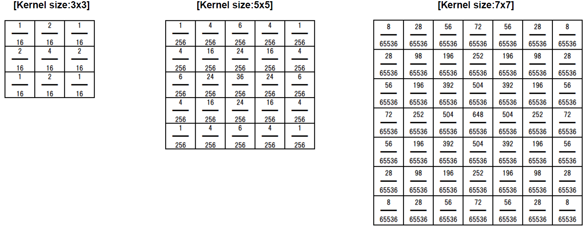

# RZ/V2H OpenCV Accelerator

## Supported Device
RZ/V2H 
<br>

## License
| Software | License |
| ------------ | --------- |
| OpenCV Accelerator | [3-clause BSD](licenses/opencva/LICENSE) |
| DRP Driver | [GPL-2.0](licenses/drp-driver/LICENSE)  | 

## List of Abbreviations and Acronyms
| Abbreviation | Full form |
| ------------ | --------- |
| BSP | Board support package |
| DRP | Dynamically Reconfigurable Processor | 
| OpenCV | Open-source Computer Vision library |
| OpenCVA | OpenCV Accelerator |  

## Table of Contents
[1. Overview](#1-overview)  
[2. Usage of OpenCV Accelerator](#2-usage-of-opencv-accelerator)  
[3. OpenCVA Function List](#3-opencva-function-list)  
[4. OpenCVA API specification and condition for using DRP](#4-opencva-api-specification-and-condition-for-using-drp)  
[5. API functions to control OpenCVA](#5-api-functions-to-control-opencva)  
[6. DRP conflict](#6-drp-conflict)  

# 1. Overview

## 1.1. Overview
This manual explains the OpenCV Accelerator in RZ/V2H Linux. OpenCV Accelerator performs OpenCV function in high performance without changing OpenCV API.

## 1.2. About OpenCV Accelerator
OpenCV Accelerator (referred to below as OpenCVA) can perform OpenCV functions using Dynamically Reconfigurable Processor (=DRP).   

If DRP is [enabled](#51-oca_activate) and the parameters of OpenCV meet the [conditions](#4-opencva-api-specification-and-condition-for-using-drp), OpenCV is executed using DRP. If DRP is disabled or the parameters do not match, then OpenCV is executed using CPU. If the DRP is used, OpenCV will be executed at high performance. The performance depends on the parameters.    

The output OpenCVA using DRP is almost identical to output OpenCV using CPU, but not exactly the same. Much of this difference is due to the accuracy of in the DRP's arithmetic unit, and some is due to differences in algorithms.

<br><span style="color: red; ">
**DRP is also used for video decoding function, however since DRP is a common HW resource, OpenCVA and video decoding function cannot be used at the same time. In case of conflicting use of DRP, it causes an exception errors or performance degradation.    
For details, please see [Chapter 5.2](#52-oca_conflictnotification) and [Chapter 6](#6-drp-conflict).**
</span><br>

## 1.3. Restrictions
None.  

# 2. Usage of OpenCV Accelerator

## 2.1. OpenCV Version  
OpenCVA is based on as follows version of OpenCV.  
**OpenCV 4.1.0-r0**  
For datails, please see [OpenCV Document](https://docs.opencv.org/4.1.0/index.html)  

## 2.2. How to use
You can use OpenCVA same as OpenCV as usual and you do not need to consider of OpenCVA architecture. OpenCVA is automatically executed by DRP as follows if it matches the conditions under which DRP can be used. For the DRP using conditions, see [Chapter 4](#4-opencva-api-specification-and-condition-for-using-drp).  
OpenCVA can disable DRP, for each function. See [Chapter 5.1](#51-oca_activate) for details.  
<br>



# 3. OpenCVA Function List

The following table lists the OpenCV functions that can be executed using DRP in the OpenCVA.

| OpenCV function name | Function |
| -------------------- | -------- |
| [4.1. resize](#41-resize) |  Image Resize. |
| [4.2. cvtColor](#42-cvtcolor) | Change color space. |
| [4.3. cvtColorTwoPlane](#43-cvtcolortwoplane) | Change color space. |
| [4.4. GaussianBlur](#44-gaussianblur) | Gaussian filter process. |
| [4.5. dilate](#45-dilate) | Areas of bright regions grow. |
| [4.6. erode](#46-erode) | Areas of dark regions grow. |
| [4.7. morphologyEX](#47-morphologyex) | Combination of dilate and erode. |
| [4.8. filter2D](#48-filter2d) | Image convolving. |
| [4.9. Sobel](#49-sobel) | Extracting image edges. |
| [4.10. adaptiveThreshold](#410-adaptivethreshold) | Transforms a grayscale image to a binary image according to the formulae. |
| [4.11. matchTemplate](#411-matchtemplate) | Compares a template against overlapped image regions. |
| [4.12. wrapAffine](#412-wrapaffine) | Transforms the source image using the 2x3 matrix. |
| [4.13. wrapPerspective](#413-wrapperspective) | Transforms the source image using the 3x3 matrix. |
| [4.14. pyrDown](#414-pyrdown) | Downsampling step of the Gaussian pyramid construction. |
| [4.15. pyrUp](#415-pyrup) | Upsampling step of the Gaussian pyramid construction. |
| [4.16. FAST](#416-fast) | Detects corners using the FAST algorithm. |
| [4.17. remap](#417-remap) | Applies a generic geometrical transformation to an image. |

# 4. OpenCVA API specification and condition for using DRP
This chapter describes the OpenCV API that can be executed by DRP, and their conditions for using DRP.
## 4.1. resize

### 4.1.1. outline
Resize an image, set desired scale of each axis or set desired size for the output image.  
```
void cv::resize (InputArray src, OutputArray dst, Size dsize, double fx = 0, double fy = 0, int interpolation = INTER_LINEAR)
```
| parameter | required/optional | description |
| --------- | ----------------- | ----------- |
| src | required | Source image |
| dst | required | Destination image |
| dsize	| required | Desired size for the destination image |
| fx(=0) | optional | Horizontal axis scale |
| fy(=0) | optional | Vertical axis scale |
| interpolation<br>(=INTER_LINEAR) | optional | One of the interpolation algorithm methods<br>(see InterpolationFlags in [OpenCV document](https://docs.opencv.org/4.1.0/index.html))|

### 4.1.2. Conditions for using DRP
If the following conditions apply, OpenCVA execute resizing process using DRP.
| parameter | range/values | note |
| --------- | ------------ | ---- |
| src | width: 2 - 3840<br> height: 2 - 2160<br> channels: 1 - 4<br> bit-depth: 8bit | |
| dsize | width: 2 - 3840<br> height: 2 - 2160 | ’0’ can also be set. In that case,<br> “fx” and “fy” parameter are valid.|
| fx | (src_img width * fx): 2 - 3840 | Valid if dsize is 0. |
| fy | (src_img height * fy): 2 - 2160	| Valid if dsize is 0. |
| interpolation	| INTER_LINEAR | |
  
## 4.2. cvtColor

### 4.2.1. outline
Converts an input image from one color space to another.  
```
void cv::cvtColor (InputArray src, OutputArray dst, int code, int dstCn = 0 )
```
| parameter | required/optional | description |
| --------- | ----------------- | ----------- |
| src | required | Source image |
| dst | required | Destination image |
| code | required | Color space conversion code (see ColorConversionCode in [OpenCV document](https://docs.opencv.org/4.1.0/index.html))|
| dstCn (=0) | optional | Number of channels in the destination image.  If the default parameter (=0) specified, the number of the channels is derived automatically from src and code |

### 4.2.2. Conditions for using DRP
If the following conditions apply, OpenCVA execute cvtColor process using DRP.
| parameter | range/values | note |
| --------- | ------------ | ---- |
| src | width: 4 or more, even<br> height: 6 or more, even<br> channels: 2<br> bit-depth: 8bit | |
| code | COLOR_YUV2RGB_UYVY<br> COLOR_YUV2BGR_UYVY<br> COLOR_YUV2RGB_YUY2<br> COLOR_YUV2BGR_YUY2<br> COLOR_YUV2RGB_YVYU<br> COLOR_YUV2BGR_YVYU | |
| dstCn | 0 | Default value |
  
## 4.3. cvtColorTwoPlane

### 4.3.1. outline
Converts an image from one color space to another where the source image is stored in two planes.  
```
void cv::cvtColorTwoPlane (InputArray src1, InputArray src2, OutputArray dst, int code)
```
| parameter | required/optional | description |
| --------- | ----------------- | ----------- |
| src1 | required | Source image of the Y plane |
| src2 | required | Source image of the U/V plane |
| dst | required | Destination image |
| code | required | Specifies the type of conversion |

### 4.3.2. Conditions for using DRP
If the following conditions apply, OpenCVA execute cvtColorTwoPlane process using DRP.
| parameter | range/values | note |
| --------- | ------------ | ---- |
| src1 | width: 4 or more, even<br> height: 6 or more, even<br> channels: 1<br> bit-depth: 8bit | |
| src2 | width: Half size of src1<br> height: Half size of src1<br> channels: 2<br> bit-depth: 8bit | |
| code | COLOR_YUV2BGR_NV12<br> COLOR_YUV2RGB_NV12<br> COLOR_YUV2BGR_NV21<br> COLOR_YUV2RGB_NV21 | |


## 4.4. GaussianBlur

### 4.4.1. outline
GaussianBlur is one of image blurring (image smoothing) function. In this function a Gaussian kernel is used to produce the smoothed image.    
GaussianBlur process with DRP supports following Gaussian filters with kernel sizes.  
Kernel size: 3, 5, or 7      
Filters used are as follows.


```
void GaussianBlur (InputArray src, OutputArray dst, Size ksize, double sigmaX, double sigmaY = 0, int borderType = BORDER_DEFAULT)
```
| parameter | required/optional | description |
| --------- | ----------------- | ----------- |
| src | required | Source image |
| dst | required | Destination image |
| ksize | required | Gaussian kernel size |
| sigmaX | required | Gaussian kernel standard deviation in X direction |
| sigmaY (=0) | optional | Gaussian kernel standard deviation in Y direction |
| borderType<br>(=BORDER_DEFAULT) | optional | Pixel extrapolation method (see BorderTypes in [OpenCV document](https://docs.opencv.org/4.1.0/index.html)) |

### 4.4.2. Conditions for using DRP
If the following conditions and apply, OpenCVA execute GaussianBlur process using DRP.
| parameter | range/values | note |
| --------- | ------------ | ---- |
| src | width: 16 or more, even<br> height: 16 or more, even<br> channels: 1 - 4<br> bit-depth: 8bit<br> size limit: 4K(3840x2160) | |
| ksize | {3,3}, {5,5}, or {7,7} | Gaussian kernel size = 3, 5, or 7 |
| sigmaX | 0<sup>*</sup> | |
| sigmaY | 0<sup>*</sup> | Default value |
| borderType | BORDER_DEFAULT | Default value |    

*:In addition to above table, DRP is used in parameter combination “src channels = 1, ksize = {7,7}, sigmaX = 2, sigmaY = 2”.

## 4.5. dilate

### 4.5.1. outline
Expands the area of bright areas in the image.  
```
void cv::dilate (InputArray src, OutputArray dst, InputArray kernel, Point anchor = Point (-1, -1), int iterations = 1, int borderType = BORDER_CONSTANT, const Scalar & borderValue = morphologyDefaultBorderValue() )
```
| parameter | required/optional | description |
| --------- | ----------------- | ----------- |
| src | required | Input image |
| dst | required | Destination image |
| kernel | required | Dilate kernel size |
| anchor<br>(=Point (-1, -1) ) | optional | Position of the anchor within the element.<br>Default value (-1, -1) means that the anchor is at the element center. |
| iterations (=1) | optional | Number of times dilation |
| borderType<br>(=BORDER_CONSTANT) | optional | Pixel extrapolation method |
| borderValue<br>(=morphologyDefaultBorderValue()) | optional | Border value (see morphologyDefaultBorderValue() in [OpenCV document](https://docs.opencv.org/4.1.0/index.html))|

### 4.5.2. Conditions for using DRP
If the following conditions apply, OpenCVA execute dilate process using DRP.
| parameter | range/values | note |
| --------- | ------------ | ---- |
| src | width: 16 or more, even<br> height: 16 or more, even<br> channels: 1 - 4<br> bit-depth: 8bit<br> size limit: 4K(3840x2160) | |
| kernel | Mat() | 3 x 3 rectangular structuring element |
| anchor | (-1, -1) | Default value |
| iterations | 1 - 3840 | |
| borderType | BORDER_CONSTANT or<br> BORDER_REPLICATE | |
| borderValue | morphologyDefaultBorderValue() | Default value |
  
## 4.6. erode

### 4.6.1. outline
Reduce the area of bright areas in the image.  
```
void cv::erode (InputArray src, OutputArray dst, InputArray kernel, Point anchor = Point (-1, -1), int iterations = 1, int borderType = BORDER_CONSTANT, const Scalar & borderValue = morphologyDefaultBorderValue() )
```
| parameter | required/optional | description |
| --------- | ----------------- | ----------- |
| src | required | Input image |
| dst | required | Destination image |
| kernel | required | Erode kernel size |
| anchor<br>(=Point (-1, -1) ) | optional | Position of the anchor within the element.<br>Default value (-1, -1) means that the anchor is at the element center. |
| iterations (=1) | optional | Number of times dilation |
| borderType<br>(=BORDER_CONSTANT) | optional | Pixel extrapolation method |
| borderValue<br>(=morphologyDefaultBorderValue()) | optional | Border value (see morphologyDefaultBorderValue() in [OpenCV document](https://docs.opencv.org/4.1.0/index.html))|

### 4.6.2. Conditions for using DRP
If the following conditions apply, OpenCVA execute erode process using DRP.
| parameter | range/values | note |
| --------- | ------------ | ---- |
| src | width: 16 or more, even<br> height: 16 or more, even<br> channels: 1 - 4<br> bit-depth: 8bit<br> size limit: 4K(3840x2160) | |
| kernel | Mat() | 3 x 3 rectangular structuring element |
| anchor | (-1, -1) | Default value |
| iterations | 1 - 3840 |
| borderType | BORDER_CONSTANT or<br> BORDER_REPLICATE | |
| borderValue | morphologyDefaultBorderValue() | Default value |
  
## 4.7. morphologyEX

### 4.7.1. outline
Performs advanced morphological transformations.  
This function uses both “dilate” and “erode” internally.  
```
void cv::morphologyEX (InputArray src, OutputArray dst, int op, InputArray kernel, Point anchor = Point (-1, -1), int iterations = 1, int borderType = BORDER_CONSTANT, const Scalar & borderValue = morphologyDefaultBorderValue() )
```
| parameter | required/optional | description |
| --------- | ----------------- | ----------- |
| src | required | Input image |
| dst | required | Destination image |
| op | required | Type of a morphological operation (see MorphTypes in [OpenCV document](https://docs.opencv.org/4.1.0/index.html)) |
| kernel | required | Kernel size |
| anchor<br>(=Point (-1, -1) ) | optional | Position of the anchor within the element.<br>Default value (-1, -1) means that the anchor is at the element center. |
| iterations (=1) | optional | Number of times dilation |
| borderType<br>(=BORDER_CONSTANT) | optional | Pixel extrapolation method |
| borderValue<br>(=morphologyDefaultBorderValue()) | optional | Border value (see morphologyDefaultBorderValue() in [OpenCV document](https://docs.opencv.org/4.1.0/index.html))|

### 4.7.2. Conditions for using DRP
If the following conditions apply, OpenCVA execute morphologyEX process using DRP.
| parameter | range/values | note |
| --------- | ------------ | ---- |
| src | width: 16 or more, even<br> height: 16 or more, even<br> channels: 1 - 4<br> bit-depth: 8bit<br> size limit: 4K(3840x2160) | |
| kernel | Mat() | 3 x 3 rectangular structuring element |
| anchor | (-1, -1) | Default value |
| iterations | 1 - 3840 |
| borderType | BORDER_CONSTANT or<br> BORDER_REPLICATE | |
| borderValue | morphologyDefaultBorderValue() | Default value |
  
## 4.8. filter2D

### 4.8.1. outline
Convolves an image with the kernel.  
```
void cv::filter2D (InputArray src, OutputArray dst, int ddepth, InputArray kernel, Point anchor = Point(-1,-1) , double delta = 0, int borderType = BORDER_DEFAULT )
```
| parameter | required/optional | description |
| --------- | ----------------- | ----------- |
| src | required | Source image |
| dst | required | Destination image |
| ddepth | required | Destination image depth |
| kernel | required | Convolution kernel |
| anchor<br>(=Point(-1,-1) ) | optional | Position of the anchor within the element.<br>Default value (-1, -1) means that the anchor is at the element center. |
| delta (=0) | optional | Value to add to destination image |
| borderType<br>(=BORDER_DEFAULT) | optional | Pixel extrapolation method| 

### 4.8.2. Conditions for using DRP
If the following conditions apply, OpenCVA execute filter2D process using DRP.
| parameter | range/values | note |
| --------- | ------------ | ---- |
| src | width: 16 or more, even<br> height: 16 or more, even<br> channels: 1 - 4<br> bit-depth: 8bit <br>size limit: 4K(3840x2160) |
| ddepth | -1 | The same depth as the input image. |
| kernel | size: {3,3}<br> depth: CV_32F<br> value: all element values are<br> between -128 and 127 | |
| anchor | (-1, -1) | Default value |
| delta | 0 | Default value |
| borderType | BORDER_DEFAULT | Default value |
  
## 4.9. Sobel

### 4.9.1. outline
Calculates the first image derivatives.  
```
void cv::Sobel (InputArray src, OutputArray dst, int ddepth, int dx, int dy, int ksize = 3, double scale = 1, double delta = 0, int borderType = BORDER_DEFAULT)
```
| parameter | required/optional | description |
| --------- | ----------------- | ----------- |
| src | required | Input image |
| dst | required | Destination image |
| ddepth | required | Destination image depth |
| dx | required | Order of the derivative x |
| dy | required | Order of the derivative y |
| ksize (=3) | optional | Size of the extended Sobel kernel |
| scale (=1) | optional | Scale factor |
| delta (=0) | optional | Value to add to destination image |
| intborderType<br>(=BORDER_DEFAULT) | optional	Pixel extrapolation method |

### 4.9.2. Conditions for using DRP
If the following conditions apply, OpenCVA execute sobel process using DRP.
| parameter | range/values | note |
| --------- | ------------ | ---- |
| src | width: 16 or more, even<br> height: 16 or more, even<br> channels: 1 - 4<br> bit-depth: 8bit <br>size limit: 4K(3840x2160) |
| ddepth | CV_8U | |
| dx, dy | “dx = 0, dy = 1” or<br> “dx = 1, dy = 0” | |
| ksize | 3 | default value |
| scale | 1 | default value |
| delta | 0 | default value |
| borderType | BORDER_DEFAULT | default value |
  
## 4.10. adaptiveThreshold

### 4.10.1. outline
Transforms a grayscale image to a binary image according to the formulae.  
```
void cv::adaptiveThreshold (InputArray src, OutputArray dst, double maxValue, int adaptiveMethod, int thresholdType, int blockSize, double C)
```
| parameter | required/optional | description |
| --------- | ----------------- | ----------- |
| src | required | Source image |
| dst | required | Destination image |
| maxValue | required | Non-zero value assigned to the pixels for which the condition is satisfied |
| adaptiveMethod | required | Adaptive thresholding algorithm to use (see adaptiveThresholdTypes in [OpenCV document](https://docs.opencv.org/4.1.0/index.html)) |
| thresholdType | required | Threshold type (see ThresholdTypes in [OpenCV document](https://docs.opencv.org/4.1.0/index.html)) |
| blocksize | required | Size of a pixel neighborhood that is used to calculate a threshold value
| C | required | Constant subtracted from the mean |

### 4.10.2. Conditions for using DRP
If the following conditions apply, OpenCVA execute adaptiveThreshold process using DRP.
| parameter | range/values | note |
| --------- | ------------ | ---- |
| src | width: 16 or more, even<br> height: 16 or more, even<br> channels: 1<br> bit-depth: 8bit <br>size limit: 4K(3840x2160) |
| maxValue | 0 - 255 | |
| adaptiveMethod | ADAPTIVE_THRES_MEAN_C | |
| thresholdType | THRES_BINARY or<br> THRES_BINARY_INV | |
| blocksize | 3 - 255, odd | |
| C | 0 - 255 | |
  
## 4.11. matchTemplate

### 4.11.1. outline
Compares a template against overlapped image regions.  
<span style="color: red; ">
**Caution: “matchTemplate” function is very slow in some cases using DRP, depending on the parameters. Please test if the matchTemplate process with DRP performance is enough, using the assumed parameter.**  
</span>
```
void cv::matchTemplate(InputArray image, InputArray templ, OutputArray result, int method, InputArray mask = noArray() )
```
| parameter | required/optional | description |
| --------- | ----------------- | ----------- |
| image | required | Input image |
| templ | required | Template image |
| result | required | Map of comparison results<br> Depth:32FC1<br> Width: image width - templ width +1<br> Height: image height - templ height +1 |
| method | required | Specifying the comparison method (see TemplateMatchModes in [OpenCV document](https://docs.opencv.org/4.1.0/index.html)) |
| mask (= noArray() ) | optional | Mask of searched template |

### 4.11.2. Conditions for using DRP
If the following conditions apply, OpenCVA execute matchTemplate process using DRP.
| parameter | range/values | note |
| --------- | ------------ | ---- |
| src | width: 16 or more, even<br> height: 16 or more, even<br> channels: 1 - 4<br> bit-depth: 8bit <br>size limit: FHD(1920x1080) | |
| templ | width: 8 or more, even<br> height: 8 or more, even<br> channels: same value as image<br> bit-depth: same value as image<br> size limit: image size | |
| method | CV_TM_SQDIFF<br> CV_TM_SQDIFF_NORMED<br> CV_TM_CCORR<br> CV_TM_CCRR_NORMED | |
| mask | noArray() | Default value |
  
## 4.12. wrapAffine

### 4.12.1. outline
An affine transformation to an image.  
```
void cv::warpAffine (InputArray src, OutputArray dst, InputArray M, Size dsize, int flags = INTER_LINEAR, int borderMode = BORDER_CONSTARNT, const Scalar & borderValue = Scalar() )
```
| parameter | required/optional | description |
| --------- | ----------------- | ----------- |
| src | required | Input image |
| dst | required | Destination image |
| M | required | Transformation matrix (2x3) |
| dsize | required | Size of destination image |
| flags<br>(=INTER_LINEAR) | optional | One of the interpolation algorithm methods (see InterpolationFlags in [OpenCV document](https://docs.opencv.org/4.1.0/index.html)) |
| borderMode<br>(=BORDER_CONSTARNT) | optional | Pixel extrapolation method (see BorderTypes in [OpenCV document](https://docs.opencv.org/4.1.0/index.html)) | 
| borderValue<br>(=Scalar() ) | optional | Border value |

### 4.12.2. Conditions for using DRP
If the following conditions apply, OpenCVA execute warpAffine process using DRP.
| parameter | range/values | note |
| --------- | ------------ | ---- |
| src | width: 16 or more, even<br> height: 16 or more, even<br> channels: 1 - 4<br> bit-depth: 8bit <br>size limit: 4K(3840x2160) | |
| M | CV_32F | |	
| dsize | width: 16 or more, even<br> height: 16 or more, even<br> size limit: 4K(3840x2160) | |
| flags | INTER_LINEAR | default value |
| borderMode | BORDER_CONSTARNT | default value |
  
## 4.13. wrapPerspective

### 4.13.1. outline
A perspective transformation to an image.  
```
void cv::warpPerspective (InputArray src, OutputArray dst, InputArray M, Size dsize, int flags = INTER_LINEAR, int borderMode = BORDER_CONSTARNT, const Scalar & borderValue = Scalar() )
```
| parameter | required/optional | description |
| --------- | ----------------- | ----------- |
| src | required | Input image |
| dst | required | Destination image |
| M | required | Transformation matrix (3x3) |
| dsize | required | Size of destination image |
| flags<br>(=INTER_LINEAR) | optional | One of the interpolation algorithm methods (see InterpolationFlags in [OpenCV document](https://docs.opencv.org/4.1.0/index.html)) |
| borderMode<br>(=BORDER_CONSTARNT) | optional | Pixel extrapolation method (see BorderTypes in [OpenCV document](https://docs.opencv.org/4.1.0/index.html)) | 
| borderValue<br>(=Scalar() ) | optional | Border value |

### 4.13.2. Conditions for using DRP
If the following conditions apply, OpenCVA execute warpPerspective process using DRP.
| parameter | range/values | note |
| --------- | ------------ | ---- |
| src | width: 16 or more, even<br> height: 16 or more, even<br> channels: 1 - 4<br> bit-depth: 8bit <br>size limit: 4K(3840x2160) | |
| M | CV_32F | |	
| dsize | width: 16 or more, even<br> height: 16 or more, even<br> size limit: 4K(3840x2160) | |
| flags | INTER_LINEAR | default value |
| borderMode | BORDER_CONSTARNT | default value |
  
## 4.14. pyrDown

### 4.14.1. outline
Blurs an image and downsamples it.  
```
void cv::pyrDown (InputArray src, OutputArray dst, const Size & dstsize = Size(), int borderType = BORDER_DEFAULT)
```
| parameter | required/optional | description |
| --------- | ----------------- | ----------- |
| src | required | Input image |
| dst | required | Destination image |
| dstsize(=Size()) | optional | Destination image size | 
| intborderType<br>(=BORDER_DEFAULT) | optional | Pixel extrapolation method |

### 4.14.2. Conditions for using DRP
If the following conditions apply, OpenCVA execute pyrDown process using DRP.
| parameter | range/values | note |
| --------- | ------------ | ---- |
| src | width: 16 or more, even<br> height: 16 or more, even<br> channels: 1 - 4<br> bit-depth: 8bit <br>size limit: 4K(3840x2160) | |
| dstsize | Size() or<br> Size( width/2, height/2) | |	
| borderType | BORDER_DEFAULT | default value |
  
## 4.15. pyrUp

### 4.15.1. outline
Blurs an image and upsamples it.  
```
void cv::pyrUp (InputArray src, OutputArray dst, const Size & dstsize = Size(), int borderType = BORDER_DEFAULT)
```
| parameter | required/optional | description |
| --------- | ----------------- | ----------- |
| src | required | Source image |
| dst | required | Destination image |
| dstsize(=Size()) | optional | Destination image size | 
| intborderType<br>(=BORDER_DEFAULT) | optional | Pixel extrapolation method |

### 4.15.2. Conditions for using DRP
If the following conditions apply, OpenCVA execute pyrUp process using DRP.
| parameter | range/values | note |
| --------- | ------------ | ---- |
| src | width: 8 or more, even<br> height: 8 or more, even<br> channels: 1 - 4<br> bit-depth: 8bit <br>size limit: FHD(1920x1080) | |
| dstsize | Size() or<br> Size( width\*2, height\*2) | |
| borderType | BORDER_DEFAULT | default value |


## 4.16. FAST

### 4.16.1. outline
Detects corners using the FAST algorithm.  
```
void cv::Fast (InputArray image, std::vector<KeyPoint> &keypoints, int threshold, bool nonmaxSuppression = true, FastFeatureDetector::DetectorType type)
```
| parameter | required/optional | description |
| --------- | ----------------- | ----------- |
| image | required | Input image (grayscale image) |
| keypoints | required | keypoints detected on the image |
| threshold | required | threshold on difference between intensity of the central pixel and pixels of a circle around this pixel. |
| nonmaxSuppression (=true) | optional | if true, non-maximum suppression is applied to detected corners (keypoints). |
| type<br>(=FastFeatureDetector::TYPE_9_16) | optional | detector type |

### 4.16.2. Conditions for using DRP
If the following conditions apply, OpenCVA execute FAST process using DRP.
| parameter | range/values | note |
| --------- | ------------ | ---- |
| image | width: 16 or more, even<br> height: 16 or more, even<br> channels: 1<br> bit-depth: 8bit<br> size limit: 4K(3840x2160) | |
| threshold | 0 - 255 | |
| nonmaxSuppression | true | default value |
| type | FastFeatureDetector::TYPE_9_16 | default value |

## 4.17. remap

### 4.17.1. outline
Applies a generic geometrical transformation to an image.  
```
void cv::remap (InputArray src, OutputArray dst, InputArray map1, InputArray map2, int interpolation, int borderMode = BORDER_CONSTANT, const Scalar & borderValue = Scalar())
```
| parameter | required/optional | description |
| --------- | ----------------- | ----------- |
| src | required | Source image. |
| dst | required | Destination image. It has the same size as map1 and the same type as src. |
| map1 | required | The first map of either (x,y) points or just x values having the type CV_16SC2, CV_32FC1, or CV_32FC2. See convertMaps for details on converting a floating point representation to fixed-point for speed. |
| map2 | optional | The second map of y values having the type CV_16UC1, CV_32FC1, or none (empty map if map1 is (x,y) points), respectively. |
| interpolation | optional | Interpolation method (see [InterpolationFlags](https://docs.opencv.org/4.1.0/da/d54/group__imgproc__transform.html#ga5bb5a1fea74ea38e1a5445ca803ff121)). The method [INTER_AREA](https://docs.opencv.org/4.1.0/da/d54/group__imgproc__transform.html#gga5bb5a1fea74ea38e1a5445ca803ff121acf959dca2480cc694ca016b81b442ceb) is not supported by this function. |
| borderMode | optional | Pixel extrapolation method (see [BorderTypes](https://docs.opencv.org/4.1.0/d2/de8/group__core__array.html#ga209f2f4869e304c82d07739337eae7c5)). When borderMode=[BORDER_TRANSPARENT](https://docs.opencv.org/4.1.0/d2/de8/group__core__array.html#gga209f2f4869e304c82d07739337eae7c5a886a5eb6b466854d63f9e742d5c8eefe), it means that the pixels in the destination image that corresponds to the "outliers" in the source image are not modified by the function. |
| borderValue | optional | Value used in case of a constant border. By default, it is 0. |

Note: Due to current implementation limitations the size of an input and output images should be less than 32767x32767.  

### 4.17.2. Conditions for using DRP
If the following conditions apply, OpenCVA execute remap process using DRP.
| parameter | range/values | note |
| --------- | ------------ | ---- |
| src | width: 16 or more, even<br> height: 16 or more, even<br> channels: 4 or less<br> bit-depth: 8bit<br> size limit: 4K(3840x2160) | |
| map1 | width: 16 or more, even<br> height: 16 or more, even<br> type: CV_32FC2<br> size limit: 4K(3840x2160)<br>Not fragmented. |  |
| map2 | none | |
| interpolation | INTER_LINEAR | |
| borderMode | BORDER_CONSTANT | |

# 5. API functions to control OpenCVA
This chapter describes API functions to control OpenCVA.

## 5.1. OCA_Activate

### [Summary]  
Disable or enable DRP used for OpenCV process.

### [Function name]	
OCA_Activate

### [Calling format]
int OCA_Activate (unsigned long* OCA_list);

### [Arguments]
OCA_list	: OpenCVA function activation table.

### [Return]
0 : OK  
-1: Error

### [Feature]
Disable or enable DRP used for OpenCV, for each of OpenCV function. By default, all are enabled. If disabled, the OpenCV function execute by CPU.  
The argument of the API function is the array variable OCA_list[]. See the following table for OCA_list[] index and OpenCV functions.  
  
| index of OCA_list[] | OpenCV function |
| ------------------- | --------------- |
| 0 | resize |
| 2 | cvtColor, cvtColorTwoPlane |
| 4 | GaussianBlur |
| 5 | dilate, morphologyEX |
| 6 | erode, morphologyEX |
| 7 | Filter2D |
| 8 | Sobel |
| 9 | adaptiveThreshold |
| 10 | matchTemplate |
| 11 | warpAffine |
| 12 | pyrDown |
| 13 | perUp |
| 14 | warpPerspective |
| 15 | FAST |
| 16 | remap |
| Others | (unused) |    

*note: OCA_list[] table type and size is “unsigned long OCA_list[16]”.*

Setting the OCA_list[index] to 1 and then executing OCA_Activate(), then the corresponding DRP is enabled. If 0 is set, it is desabled.  
Values other than 0 and 1 are ignored.  
  
### [Sample]
```
unsigned long OCA_list[16];
for(int i=0; i<16; i++)OCA_list[i]=2;
/* Disable DRP(Sobel) */
OCA_list[8] = 0;	//Disable
OCA_Activate( &OCA_list[0] );
```

## 5.2 OCA_ConflictNotification

### [Summary]
Sets the behavior when DRP conflicts occur (exception error occurs or not).

### [Function name]
OCA_ConflictNotification

### [Calling format]
void OCA_ConflictNotification (int oca_conflict );

### [Arguments]
oca_conflict	0: When DRP conflicts, exception error occurs.  
Not 0: When DRP conflicts, exception error does not occur, and the OpenCV function is executed by CPU.

### [Feature]
Sets the behavior when DRP conflicts occur (exception error occurs or not). By default, it causes an exception error do to DRP conflict.  
e.g., execute OpenCV using DRP while the video decoding process is using the DRP.  
The error code for exception errors is -501.

### [Sample]
The following is a sample to handle exception error.  
```
/* Exception error enable */
OCA_ConflictNotification( 0 );
try{
cv::GaussianBlur(src, dst, {7,7},0,0);
} catch(cv::Exception& e) {
    if( e == -501 ){/* exception error handling */}
}
```
# 6. DRP conflict
This chapter describes DRP conflict.

## 6.1. About DRP conflict
OpenCVA use “Dynamically Reconfigurable Processor” (=DRP). And the video decoding functions use the same DRP. There is only one DRP used by these functions on a device. And the function occupies the DRP while it is executing.  
If the OpenCV use the DRP but is unable to do so because the DRP is already being used by another function, this is called “DRP conflict.”  
  
OpenCVA cause DRP conflicts in the case of start OpenCV using DRP, while the video decoding function uses DRP in parallel.
  
If the case doesn't matches, then the DRP does not conflict, i.e., video decoding and OpenCV using DRP are executed sequentially.  
  
## 6.2. What happened if there was a conflict, and how to handle it
If the OpenCVA occurred DRP conflict, it raises an exception error or execute OpenCV function by CPU instead of the DRP. (selected by the OCA_ConflictNotification()).  
If the DRP conflict occur exception error, the user application must be able to handle the exception error, as in [Chapter 5.2](#52-oca_conflictnotification) sample.  
If the OpenCV function executed by CPU, the user applications do not need to support anything, but performance of the OpenCV should be confirmed.  
